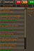

# Collection Log Progress

Find your next Collection Log goal with coloured page names, completion percentages and filters inside the log itself.

## See progress at a glance

- **Colour names** marks unstarted pages red, partial pages orange and completed pages green.
- **Show percentages** adds whole-number progress to page and tab names. **Show 0%** and **Show 100%** can be switched off separately to reduce clutter.
- **Smooth colour scale** blends page colours as progress increases; it starts off. When colours are enabled, the five aggregate tab titles always use the smooth scale.
- Customise the **Unstarted**, **Partial** and **Completed** colours to suit your setup.

## Choose what to work on

Use the three colour-matched **Hide** checkboxes inside the Collection Log to hide unstarted, partial or completed pages. The remaining rows close up and your filter choices persist between sessions.

- Hide completed pages to focus on missing slots.
- Hide unstarted and completed pages to revisit goals already in progress.
- Enable **Sort by completion** to put the closest pages first; **Reverse sort order** starts with the least complete.
- The compact in-log order control cycles between native order and both completion directions. Equal percentages remain alphabetical.

## Load your progress

Open **your own Collection Log** and click its native **Search** button once. The plugin listens for the item snapshot; until it arrives, the controls say `Click Search to load`. Click Search again whenever you want to refresh.

The central item panel stays as it is. Collection Log data remains inside the client, with no external service or file export.

## Installation

Open RuneLite's **Configuration → Plugin Hub**, search for **Collection Log Progress** and install it. Open the plugin's settings to customise the options above.

[View on the Plugin Hub](https://runelite.net/plugin-hub/show/collection-log-progress).

## Development

See [development and implementation reference](DEVELOPMENT_REFERENCE.md) for the preserved setup instructions, technical details, testing notes and existing project documentation.

## Support

Enjoy the plugin? [Visit the GSVS UK ACM Patreon shop](https://www.patreon.com/cw/GSVS_UK_ACM/shop) to support the work.
